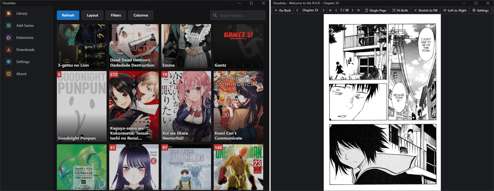
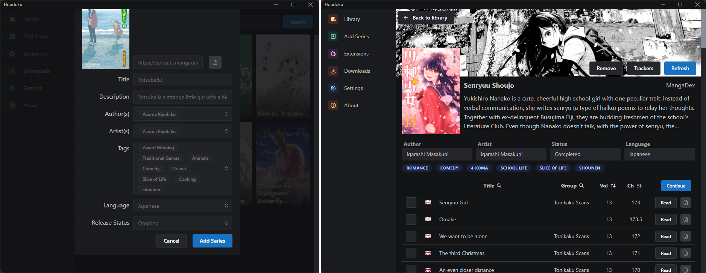

[](https://github.com/xgi/houdoku/releases)


Houdoku is a free and open source manga reader for the desktop.

---

## Features

- Read manga from popular websites or import ones from your filesystem,
  all in one place.
- Customizable reader interface with multiple layouts and settings.
- Tagging and filtering support to easily browse and manage large libraries.
- Cross-platform!

---




---

## Download

Download Houdoku from
[the releases page](https://github.com/xgi/houdoku/releases).

- **Windows**: Use the `.exe` installer.
- **macOS**: Use the `.dmg`.
- **Linux**: Use the `.AppImage`. Releases may be available on your
  package manager, but are not officially maintained.

The application can check for and download updates automatically.

## Development

Install dependencies:

```
yarn
```

Start the app in the dev environment:

```
yarn start
```

## Stack

**Application**: This is an Electron application. The majority of the functionality is performed in the renderer thread. Exceptions are for cases like accessing the window class (i.e. to support minimizing the window), locating application directories, and for working with extensions. The renderer can invoke these functions through ipc.

**UI**: The interface uses React components. Most base components (text, buttons, links, etc.) come from the [antd](https://ant.design)
framework. Each component has a CSS file for custom styles.

**State**: Redux (and react-redux) is used for state management. There are several defined "features" (located in `src/features/`) which encompass the majority of user-initiated functionality. Using React Hooks is acceptable, but discouraged, for small components. This is a convenience; preferably all state should be handled by Redux.

**Database**: Library data is stored with
[Lovefield](https://google.github.io/lovefield). Miscellaneous data,
including user settings, is saved with `localStorage`.

**Plugins/Extensions**: See the [houdoku-extensions](https://github.com/xgi/houdoku-extensions) repo. Dynamic loading is handled by [aki-plugin-manager](https://github.com/xgi/aki-plugin-manager).

## Extensions

Houdoku does not host any material; it retrieves media from public websites
("content sources"). Support for content sources is provided through
various extensions which can be installed/updated from the Extensions tab
within the client. Houdoku is not affiliated with any content source.

There are no "recommended extensions", but you should feel free to
try several and mix-and-match according to which ones work well for you.

If you would like to request support for a website or report an issue with
an existing extension, please go to the
[houdoku-extensions](https://github.com/xgi/houdoku-extensions) repo.

## License

[MIT License](https://github.com/xgi/houdoku/blob/master/LICENSE.txt)
